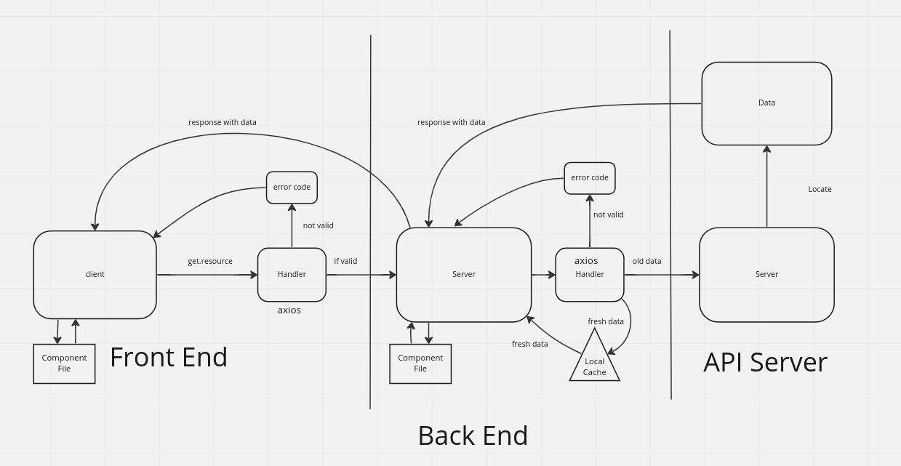

# Project Name: City Explorer

**Author**: Ty Aponte
**Version**: 1.0.0

## Overview
<!-- Provide a high level overview of what this application is and why you are building it, beyond the fact that it's an assignment for this class. (i.e. What's your problem domain?) -->
built to retrieve assets from an API and practice with a broader scope application, and learn how REST is implemented.

## Getting Started
<!-- What are the steps that a user must take in order to build this app on their own machine and get it running? -->

install React, Bootstrap , and Axios packages/ dependencies. acquire API key of your own.

## Architecture

made using Javascript, CSS,html, REACT, Bootstrap, Axios, LocationIQ

## Change Log
<!-- Use this area to document the iterative changes made to your application as each feature is successfully implemented. Use time stamps. Here's an example:

01-01-2001 4:59pm - Application now has a fully-functional express server, with a GET route for the location resource. -->

1/17/2023 5:25 implemented basic functionality, built out env files and dynamic aspects.

## Credit and Collaborations

assisted by [Brennan Malone](https://github.com/brennan-malone)

Time Estimates
For each of the lab features, make an estimate of the time it will take you to complete the feature, and record your start and finish times for that feature:

Name of feature: initialization and dependencies

Estimate of time needed to complete: 15 min

Start time: 330

Finish time: 345

Actual time needed to complete: 15 min

Name of feature: location

Estimate of time needed to complete: 1hr

Start time: 345

Finish time: 5

Actual time needed to complete: 1.25hr

Name of feature: map
Estimate of time needed to complete: 20 min

Start time: 515

Finish time: 719 lots of errors from changing api key aaaaaaaaaa

Actual time needed to complete: 2hr. conceptually though, its just refactoring the same component a little.

Name of feature: error message

Estimate of time needed to complete: 30 min

Start time: did early to help along the way. 345

Finish time: 5

Actual time needed to complete: i would say 30 min , but end time was same as location, as they were developed concurrently.

WRRC pic final

Name of feature:weather-day

Estimate of time needed to complete: 1hr

Start time: 730

Finish time: 750

Actual time needed to complete: 20 mins
